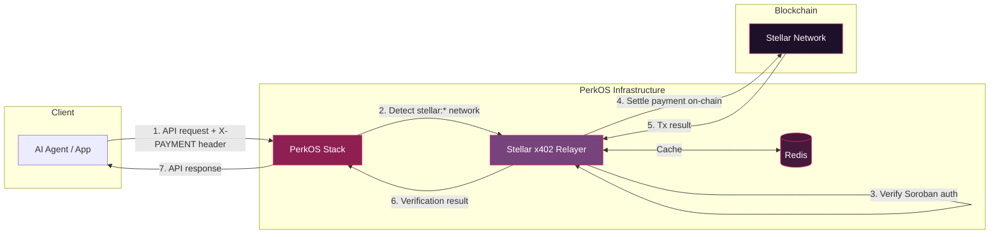
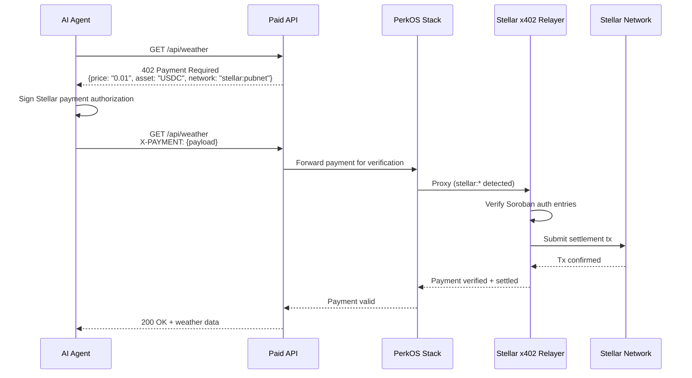
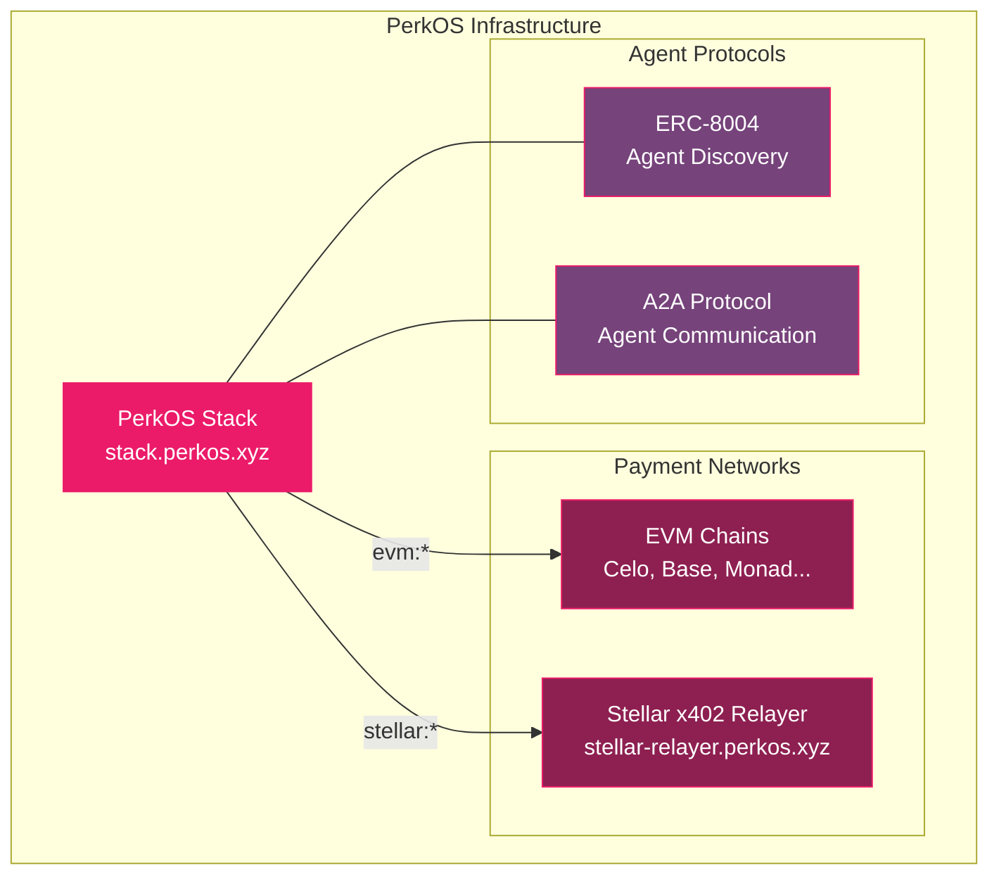

# PerkOS Stellar x402 Relayer

x402 payment facilitator for Stellar — part of **PerkOS Infrastructure**.

Verifies and settles [x402](https://github.com/coinbase/x402) payments on Stellar (USDC), enabling AI agents to pay for API calls using the HTTP 402 Payment Required protocol. Powered by [OpenZeppelin Relayer](https://docs.openzeppelin.com/relayer).

## Why

The agentic economy needs payment rails on every chain. This relayer extends PerkOS Stack to support Stellar alongside EVM networks — same x402 protocol, same developer experience, new network.

- **Agents pay with one HTTP header** — no wallet popups, no manual approvals
- **Relayer covers all Stellar fees** (~$0.00001/tx) — agents never need XLM
- **USDC on Stellar** — fast settlement, near-zero cost
- **Plugs directly into PerkOS Stack** — unified multi-chain payment infrastructure

## Architecture



## Payment Flow



## Endpoints

| Route | Method | Description |
|-------|--------|-------------|
| `/api/v1/plugins/x402-facilitator/call/verify` | POST | Verify payment payload |
| `/api/v1/plugins/x402-facilitator/call/settle` | POST | Settle payment on-chain |
| `/api/v1/plugins/x402-facilitator/call/supported` | GET/POST | List supported payment kinds |

## Quick Start

### 1. Install plugin dependencies

```bash
cd x402-facilitator
pnpm install
pnpm run build
cd ..
```

### 2. Generate relayer keys

```bash
# Clone OZ Relayer to use key generation tool
git clone https://github.com/OpenZeppelin/openzeppelin-relayer /tmp/oz-relayer

# Generate keystore
cd /tmp/oz-relayer
cargo run --example create_key -- \
  --password 'YourSecurePass123!' \
  --output-dir /path/to/this/repo/config/keys \
  --filename local-signer.json

# Generate API key
cargo run --example generate_uuid

# Clean up
rm -rf /tmp/oz-relayer
```

### 3. Configure environment

```bash
cp .env.example .env
# Edit .env with your API_KEY and KEYSTORE_PASSPHRASE
```

### 4. Start services

```bash
docker compose up -d
```

### 5. Get relayer address and fund it

```bash
# Get the relayer's Stellar address
curl -H "Authorization: Bearer <API_KEY>" \
  http://localhost:8080/api/v1/relayers/stellar-relayer

# Fund with ~10 XLM for network fees
# The relayer pays all Stellar fees so agents don't need XLM
```

## Configuration

### Supported Networks

| Network | Environment | Status |
|---------|-------------|--------|
| `stellar:pubnet` | Production | Pre-configured |
| `stellar:testnet` | Development | Add to config |

### Supported Assets

| Network | Asset | Contract |
|---------|-------|----------|
| pubnet | USDC | `CCW67TSZV3SSS2HXMBQ5JFGCKJNXKZM7UQUWUZPUTHXSTZLEO7SJMI75` |
| testnet | USDC | `CBIELTK6YBZJU5UP2WWQEUCYKLPU6AUNZ2BQ4WWFEIE3USCIHMXQDAMA` |

## Integration with PerkOS Stack

This relayer is designed to work as part of PerkOS Infrastructure. PerkOS Stack automatically detects `stellar:*` networks in x402 requests and proxies them to this relayer.



### Stack Integration Example

```typescript
// In PerkOS Stack X402Service
if (network.startsWith('stellar:')) {
  const relayerUrl = process.env.STELLAR_RELAYER_URL;
  const response = await fetch(
    `${relayerUrl}/api/v1/plugins/x402-facilitator/call/verify`,
    {
      method: 'POST',
      headers: {
        'Content-Type': 'application/json',
        'Authorization': `Bearer ${process.env.STELLAR_RELAYER_API_KEY}`,
      },
      body: JSON.stringify(request),
    }
  );
  return response.json();
}
```

## Live Deployment

| Service | URL |
|---------|-----|
| Relayer | [stellar-relayer.perkos.xyz](https://stellar-relayer.perkos.xyz) |
| Demo App | [stellar-x402.perkos.xyz](https://stellar-x402.perkos.xyz) |
| PerkOS Stack | [stack.perkos.xyz](https://stack.perkos.xyz) |

## Tech Stack

- **Runtime:** [OpenZeppelin Relayer](https://docs.openzeppelin.com/relayer) (Rust)
- **Plugin:** Custom x402 facilitator (TypeScript)
- **Cache:** Redis
- **Deployment:** Docker Compose
- **Network:** Stellar (Soroban smart contracts)
- **Asset:** USDC via Soroban token contract

## References

- [x402 on Stellar — Stellar Foundation](https://stellar.org/blog/foundation-news/x402-on-stellar)
- [OZ Relayer x402 Facilitator Guide](https://docs.openzeppelin.com/relayer/guides/stellar-x402-facilitator-guide)
- [OZ x402 Facilitator Plugin](https://github.com/OpenZeppelin/relayer-plugin-x402-facilitator)
- [x402 Protocol — Coinbase](https://github.com/coinbase/x402)
- [PerkOS Stack](https://github.com/PerkOS-xyz/Stack)
- [PerkOS](https://perkos.xyz)

## License

MIT
